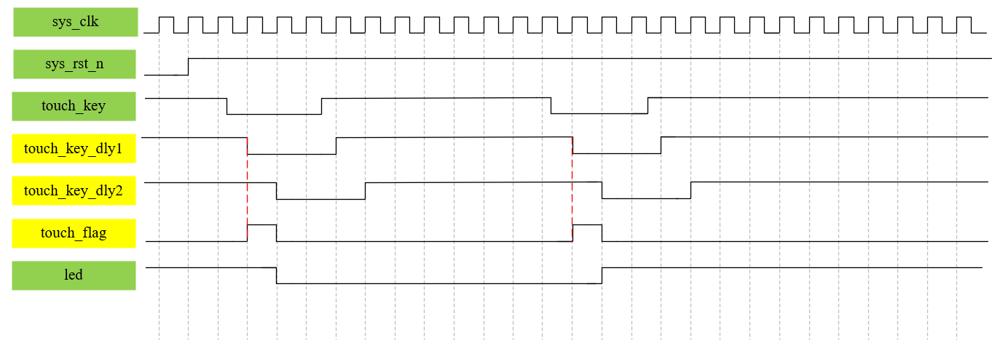

# 边沿检测电路

## 基本原理



如图所示，$\rm{}touch\_key$ 为触摸按键信号。

$step1:$ 将 $\rm{}touch\_key$ 同步到时钟 $\rm{}sys\_clk$。
$\rm{}touch\_key$ 信号与时钟 $\rm{}sys\_clk$ 不是同步的，因此我们首先要做的就是将触摸按键信号同步到时钟 $\rm{}sys\_clk$，即信号 $\rm{}touch\_key\_dly1$。同步的方法很简单，使用一个 $\rm{}D$ 触发器即可。

$step2:$ 将 $\rm{}touch\_key\_dly1$ 再延迟一个时钟周期。
再使用一个 $\rm{}D$ 触发器将 $\rm{}touch\_key\_dly1$ 再延迟一个时钟周期得到 $\rm{}touch\_key\_dly2$。

$step3:$ 使用 $\rm{}touch\_key\_dly1$ 和 $\rm{}touch\_key\_dly2$ 得到一个脉冲标志信号 $\rm{}touch\_flag$。
这个脉冲标志信号标志着触摸按键的下降沿的到来，显然是以 $\rm{}touch\_key\_dly1$ 信号为基准，即标志着 $\rm{}touch\_key\_dly1$ 信号下降沿的到来。

关键在于如何产生脉冲标志信号，这是边沿检测电路的核心。

## 脉冲标志信号 $\rm{}touch\_flag$ 的产生方法

脉冲标志信号 $\rm{}touch\_flag$ 是基于同步到时钟的 $\rm{}touch_key_dly1$ 与延迟一个时钟的 $\rm{}touch\_key\_dly2$ 产生的。

### 使用组合逻辑

```verilog
//上升沿检测
//方法 1
assign touch_flag = touch_key_dly1 & ~touch_key_dly2;
//方法 2
assign touch_flag = (touch_key_dly1 == 1'b1) & (touch_key_dly2 == 1'b0);    //这里也可以使用条件运算符

//下降沿检测
assign touch_flag = ~touch_key_dly1 & touch_key_dly2;
//方法 2
assign touch_flag = (touch_key_dly1 == 1'b0) & (touch_key_dly2 == 1'b1);    //这里也可以使用条件运算符
```

### 使用时序逻辑

```verilog
//上升沿检测
//方法 1 : 与逻辑实现
always@(posedge sys_clk or negedge sys_rst_n)
    if(~sys_rst_n)
        touch_flag <= 1'b0;
    else if((touch_key_dly1 == 1'b1) && (touch_key_dly2 == 1'b0))   //核心逻辑
        touch_flag <= 1'b1;
    else
        touch_flag <= 1'b0;
//方法 2 : 或逻辑实现
always@(posedge sys_clk or negedge sys_rst_n)
    if(~sys_rst_n)
        touch_flag <= 1'b0;
    else if((touch_key_dly1 == 1'b0) && (touch_key_dly2 == 1'b1))   //核心逻辑
        touch_flag <= 1'b0;
    else
        touch_flag <= 1'b1;

//下降沿检测
//方法 1 : 与逻辑实现
always@(posedge sys_clk or negedge sys_rst_n)
    if(~sys_rst_n)
        touch_flag <= 1'b0;
    else if((touch_key_dly1 == 1'b0) && (touch_key_dly2 == 1'b1))   //核心逻辑
        touch_flag <= 1'b1;
    else
        touch_flag <= 1'b0;
//方法 2 : 或逻辑实现
always@(posedge sys_clk or negedge sys_rst_n)
    if(~sys_rst_n)
        touch_flag <= 1'b0;
    else if((touch_key_dly1 == 1'b1) && (touch_key_dly2 == 1'b0))   //核心逻辑
        touch_flag <= 1'b0;
    else
        touch_flag <= 1'b1;
```

注意：

对于时序逻辑产生的 $\rm{}touch\_flag$ 信号，并非是图中的形式，**比图中的脉冲标志延迟了一个时钟周期**，这是由于触发器和寄存器延迟一个时钟周期的特性导致的。

在实际使用中，**推荐使用与逻辑实现**，与逻辑更清晰。

`&,|` 是按位与、按位或，`&&,||` 是逻辑与、逻辑或，两者不同，但对于只有 $\rm{}1bit$ 位宽的信号来说，两者是完全相同的。
