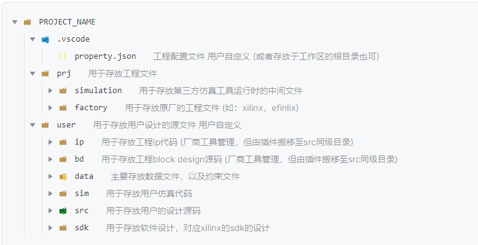
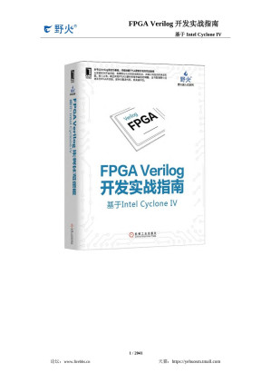

# FPGA-Basic-Tutorial

该工程只有FPGA最基础的用法，使用的是Altera和Xilinx的FPGA

工程中的 `.vscode` 是 $\rm{}vscode$ 的 $\rm{}Digital\,\,IDE$ 插件的配
置文件。

$\rm{}Digital\,\,IDE$ 的标准项目结构如下：

此外，`Altera_prj` 的 `.doc` 中存放的是项目的说明，包括模块框图、波形图等。

`Altera_prj` 主要是复现下面这本书的工程：

